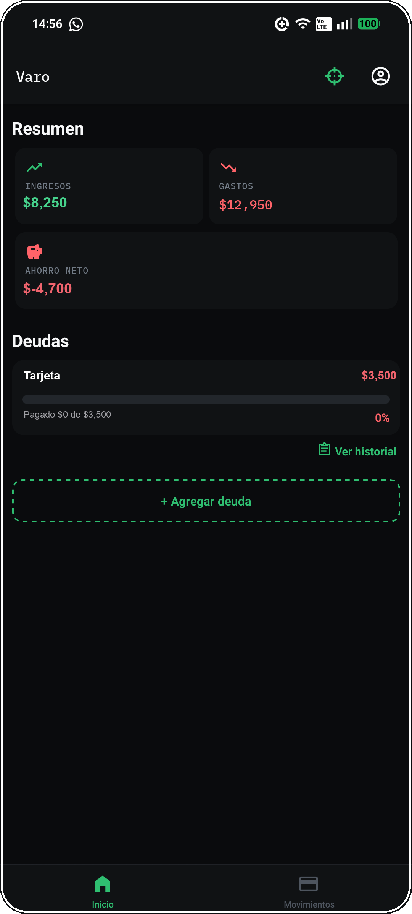
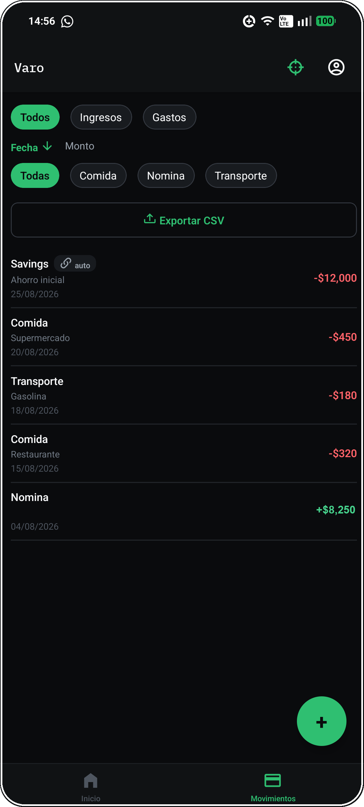
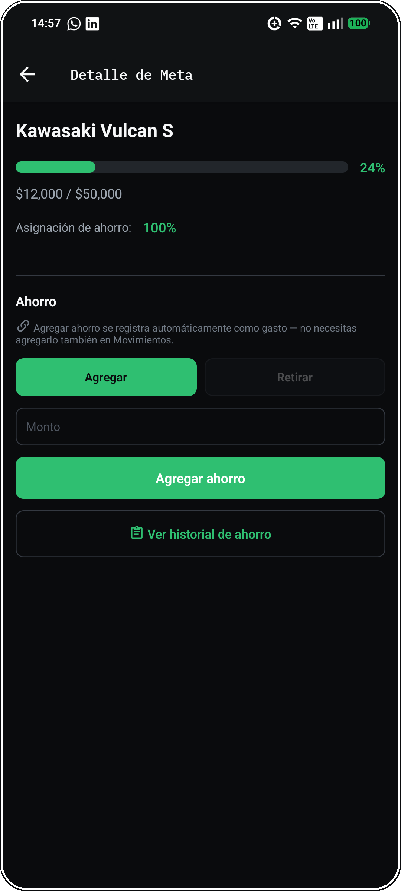

# Varo

App móvil de finanzas personales para Android. Registra tus movimientos, escanea tickets con IA, y sigue tus metas de ahorro con una predicción automática de cuándo las vas a cumplir.

<table align="center">
  <tr>
    <td align="center">
       
      <b>Dashboard</b>
    </td>
    <td align="center">
       
      <b>Movimientos</b>
    </td>
    <td align="center">
       
      <b>Metas</b>
    </td>
  </tr>
</table>

## Por qué existe

La mayoría de apps de finanzas piden que captures cada gasto a mano, y eso hace que la gente deje de usarlas a la semana. Varo resuelve eso de dos formas: **escaneo de tickets con IA** (foto al comprobante, la app extrae monto, categoría y fecha) y un **motor de predicción** que dice, con base en el historial real del usuario, si va a llegar a su meta de ahorro a tiempo o no.

## Features

- 📊 Dashboard con resumen de ingresos, gastos, ahorro neto y progreso de la meta principal
- 🧾 Escaneo de tickets con IA (Groq Vision)
- 🎯 Metas de ahorro con asignación porcentual y forecast de cumplimiento
- 💳 Deudas con historial de pagos e incrementos
- 🔒 Bloqueo de app (PIN / biometría) + JWT con refresh tokens
- 📤 Exportar movimientos a CSV

## Stack

React Native · TypeScript · React Navigation · TanStack Query

> API en NestJS + PostgreSQL: **[varo_backend](https://github.com/Hector0122/varo_backend)**

## Licencia

MIT
